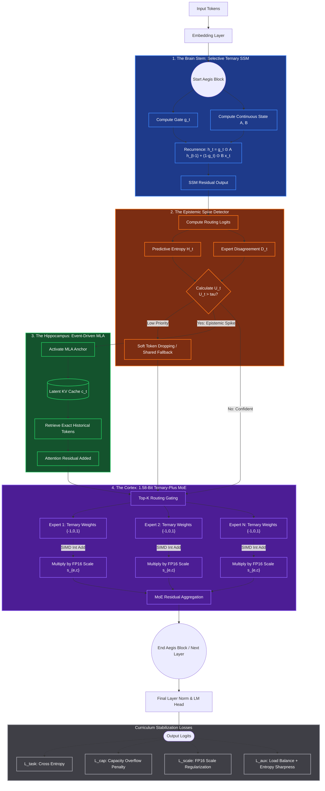

```mermaid
graph TD
    classDef stem fill:#1e3a8a,stroke:#3b82f6,stroke-width:2px,color:#fff;
    classDef router fill:#7c2d12,stroke:#f97316,stroke-width:2px,color:#fff;
    classDef hippo fill:#14532d,stroke:#22c55e,stroke-width:2px,color:#fff;
    classDef cortex fill:#4c1d95,stroke:#8b5cf6,stroke-width:2px,color:#fff;
    classDef loss fill:#3f3f46,stroke:#a1a1aa,stroke-width:2px,color:#fff;

    %% INPUT
    A["Input Tokens"] --> B["Embedding Layer"]
    B --> C(("Start Aegis Block"))

    %% BRAIN STEM (SSM)
    subgraph Brain_Stem [1. The Brain Stem: Selective Ternary SSM]
        C --> D["Compute Gate g_t"]
        C --> E["Compute Continuous State A, B"]
        D --> F["Recurrence: h_t = g_t ⊙ A h_{t-1} + (1-g_t) ⊙ B x_t"]
        E --> F
        F --> G["SSM Residual Output"]
    end
    class Brain_Stem,D,E,F,G stem;

    %% EPISTEMIC ROUTER
    subgraph Epistemic_Spike_Detector [2. The Epistemic Spike Detector]
        G --> H["Compute Routing Logits"]
        H --> I1["Predictive Entropy H_t"]
        H --> I2["Expert Disagreement D_t"]
        I1 --> J{"Calculate U_t <br> U_t > tau?"}
        I2 --> J
        J -->|Low Priority| K["Soft Token Dropping / Shared Fallback"]
    end
    class Epistemic_Spike_Detector,H,I1,I2,J,K router;

    %% HIPPOCAMPUS (MLA)
    subgraph Hippocampus [3. The Hippocampus: Event-Driven MLA]
        J -- "Yes: Epistemic Spike" --> L["Activate MLA Anchor"]
        L --> M[("Latent KV Cache c_t")]
        M --> N["Retrieve Exact Historical Tokens"]
        N --> O["Attention Residual Added"]
    end
    class Hippocampus,L,M,N,O hippo;

    %% CORTEX (MoE)
    subgraph Cortex [4. The Cortex: 1.58-Bit Ternary-Plus MoE]
        J -- "No: Confident" --> P["Top-K Routing Gating"]
        O --> P
        K --> P
        P --> Q1["Expert 1: Ternary Weights {-1,0,1}"]
        P --> Q2["Expert 2: Ternary Weights {-1,0,1}"]
        P --> Q3["Expert N: Ternary Weights {-1,0,1}"]
        
        Q1 -. "SIMD Int Add" .-> R1["Multiply by FP16 Scale s_{e,c}"]
        Q2 -. "SIMD Int Add" .-> R2["Multiply by FP16 Scale s_{e,c}"]
        Q3 -. "SIMD Int Add" .-> R3["Multiply by FP16 Scale s_{e,c}"]
        
        R1 --> S["MoE Residual Aggregation"]
        R2 --> S
        R3 --> S
    end
    class Cortex,P,Q1,Q2,Q3,R1,R2,R3,S cortex;

    %% OUTPUT & LOSSES
    S --> T(("End Aegis Block / Next Layer"))
    T --> U["Final Layer Norm & LM Head"]
    U --> V(["Output Logits"])

    subgraph Objective_Functions [Curriculum Stabilization Losses]
        V -.-> W1["L_task: Cross Entropy"]
        V -.-> W2["L_cap: Capacity Overflow Penalty"]
        V -.-> W3["L_scale: FP16 Scale Regularization"]
        V -.-> W4["L_aux: Load Balance + Entropy Sharpness"]
    end
    class Objective_Functions,W1,W2,W3,W4 loss;
```
