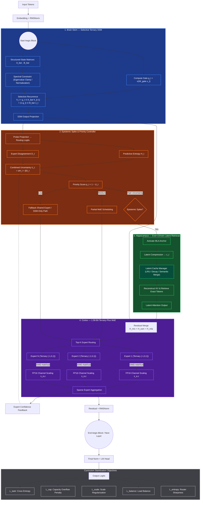

```mermaid
graph TD
    classDef stem fill:#1e3a8a,stroke:#3b82f6,stroke-width:2px,color:#fff;
    classDef router fill:#7c2d12,stroke:#f97316,stroke-width:2px,color:#fff;
    classDef hippo fill:#14532d,stroke:#22c55e,stroke-width:2px,color:#fff;
    classDef cortex fill:#4c1d95,stroke:#8b5cf6,stroke-width:2px,color:#fff;
    classDef memory fill:#064e3b,stroke:#10b981,stroke-width:2px,color:#fff;
    classDef loss fill:#3f3f46,stroke:#a1a1aa,stroke-width:2px,color:#fff;

    %% INPUT
    A["Input Tokens"] --> B["Embedding + RMSNorm"]
    B --> C(("Start Aegis Block"))

    %% ================= BRAIN STEM =================
    subgraph Brain_Stem [1. Brain Stem — Selective Ternary SSM]
        C --> D["Compute Gate g_t = σ(W_gate x_t)"]
        C --> E["Structured State Matrices A_bar , B_bar"]
        E --> E2["Spectral Constraint <br> (Eigenvalue Clamp / Normalization)"]
        D --> F["Selective Recurrence <br> h_t = g_t ⊙ A_bar h_{t-1} + (1-g_t) ⊙ B_bar x_t"]
        E2 --> F
        F --> G["SSM Output Projection"]
    end
    class Brain_Stem,D,E,E2,F,G stem;

    %% ================= EPISTEMIC CONTROLLER =================
    subgraph Epistemic_Controller [2. Epistemic Spike & Priority Controller]
        G --> H["Probe Projection → Routing Logits"]
        H --> I1["Predictive Entropy H_t"]
        H --> I2["Expert Disagreement D_t"]
        I1 --> J["Combined Uncertainty U_t = αH_t + βD_t"]
        I2 --> J
        J --> K["Priority Score p_t = 1 − U_t"]

        K -->|High Uncertainty| L{"Epistemic Spike?"}
        K -->|Medium| M["Partial MoE Scheduling"]
        K -->|Low| N["Fallback Shared Expert / SSM-Only Path"]
    end
    class Epistemic_Controller,H,I1,I2,J,K,L,M,N router;

    %% ================= HIPPOCAMPUS =================
    subgraph Hippocampus [3. Hippocampus — Event-Driven Latent Retrieval]
        L -->|Yes| O["Activate MLA Anchor"]
        O --> P["Latent Compression → c_t"]
        P --> Q["Latent Cache Manager <br> (LRU / Decay / Semantic Merge)"]
        Q --> R["Reconstruct KV & Retrieve Exact Tokens"]
        R --> S["Latent Attention Output"]
    end
    class Hippocampus,O,P,R,S hippo;
    class Q memory;

    %% Residual merge after retrieval
    S --> T["Residual Merge <br> H_mix = H_ssm + H_mla"]
    G --> T

    %% ================= CORTEX =================
    subgraph Cortex [4. Cortex — 1.58-Bit Ternary-Plus MoE]
        T --> U["Top-K Expert Routing"]
        M --> U
        N --> U

        U --> V1["Expert 1 (Ternary {-1,0,1})"]
        U --> V2["Expert 2 (Ternary {-1,0,1})"]
        U --> V3["Expert N (Ternary {-1,0,1})"]

        V1 -. SIMD Add/Sub .-> W1["FP16 Channel Scaling s_e,c"]
        V2 -. SIMD Add/Sub .-> W2["FP16 Channel Scaling s_e,c"]
        V3 -. SIMD Add/Sub .-> W3["FP16 Channel Scaling s_e,c"]

        W1 --> X["Sparse Expert Aggregation"]
        W2 --> X
        W3 --> X
    end
    class Cortex,U,V1,V2,V3,W1,W2,W3,X cortex;

    %% Feedback loop for cognitive calibration
    X --> Y["Expert Confidence Feedback"]
    Y -.-> J

    %% OUTPUT
    X --> Z["Residual + RMSNorm"]
    Z --> AA(("End Aegis Block / Next Layer"))
    AA --> AB["Final Norm + LM Head"]
    AB --> AC["Output Logits"]

    %% ================= OBJECTIVE =================
    subgraph Objective_Functions [Curriculum Stabilization Objectives]
        AC -.-> L1["L_task: Cross Entropy"]
        AC -.-> L2["L_cap: Capacity Overflow Penalty"]
        AC -.-> L3["L_scale: Scale Regularization"]
        AC -.-> L4["L_balance: Load Balance"]
        AC -.-> L5["L_entropy: Router Sharpness"]
    end
    class Objective_Functions,L1,L2,L3,L4,L5 loss;
```
